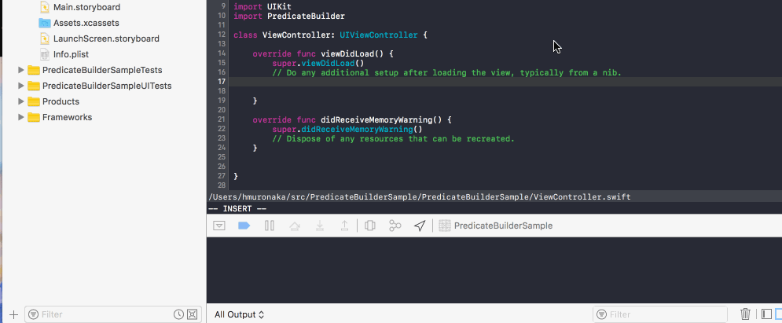
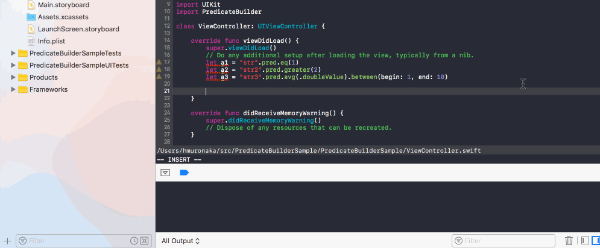

NSPredicate builder for swift
=====

# Require

- swift 3.0 +
- xcode 8.2 +
- iOS 9.0 +

# Example

```swift
func testEqInt() {
    let val = 123
    let predicate = NSPredicate(format: "key == %d", val)
    XCTAssertEqual(predicate, "key".pred.eq(val))
}

func testEqInt2() {
    let val = 123
    let predicate = NSPredicate(format: "key == %d", val)
    XCTAssertEqual(predicate, "key".pred == val)
}

func testBeginWithCD() {
    let val = "prefix"
    let predicate = NSPredicate(format: "attr beginswith[cd] %@", val)
    XCTAssertEqual(predicate, "attr".pred.beginsWith(val, options: .cd))
}

func testAny() {
    let predicate = NSPredicate(format: "ANY employees.firstname LIKE 'Matthew'")
    XCTAssertEqual(predicate, pred.any("employees.firstname").like("Matthew"))
}

func testNot() {
    let predicate = NSPredicate(format: "NOT attr == 123")
    XCTAssertEqual(predicate, !("attr".pred.eq(123)))
}

func testAve() {
    let predicate = NSPredicate(format: "expenses.@avg.doubleValue > 123")
    XCTAssertEqual(predicate, "expenses".pred.avg(.doubleValue).greater(123))
}

func testAnd() {
    let val = "str"
    let predicate = NSPredicate(format: "a == 1 AND b != %@", val)
    XCTAssertEqual(predicate, "a".pred == 1 && "b".pred != val)
}

```

More examples are [PredicateBuilderTests.swift](PredicateBuilderTests/PredicateBuilderTests.swift).


# Screenshots






# Install

* SwiftPM

# LICENSE
The MIT license
